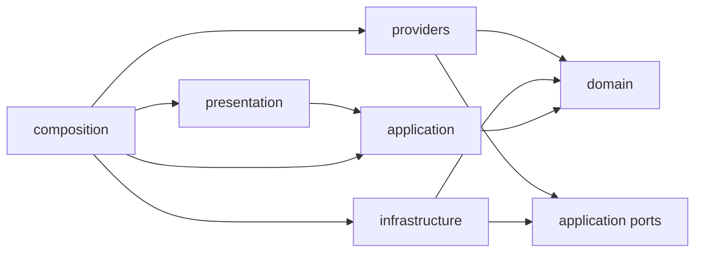

# Architecture boundaries

TicketAutomation uses explicit dependency layers with provider-neutral domain
and application contracts. Concrete provider code is isolated under
`providers`, and `composition` is the only package that assembles providers with
application workflows.

## Layer responsibilities

- `domain` owns provider-neutral business concepts, values, and invariants. It
  has no dependency on application orchestration, adapters, presentation, CLI,
  subprocess, filesystem, or Git code.
- `application` owns use cases and the ports they require. It may depend on the
  domain. It does not depend on concrete providers or infrastructure.
- `providers` contains concrete agent adapters. An adapter may depend on domain
  contracts and application ports, but it does not depend on lifecycle stage
  implementations.
- `infrastructure` contains concrete persistence, process, filesystem, and Git
  adapters. Infrastructure implements application-owned ports.
- `presentation` translates user input and renders user-facing output. It calls
  application use cases and is never imported by an inward layer or adapter.
- `composition` selects concrete adapters and connects them to application use
  cases. Provider selection and process startup belong here.

The dependency direction is inward: presentation and composition call the
application, and the application calls the domain. Concrete adapters point to
ports owned by `application`; application code never imports an adapter to use
it. Composition is the only layer that knows the complete concrete object graph.

Provider-specific configuration, command construction, failure details, and
native diagnostic evidence live in the corresponding package under `providers`.
Application and domain code use provider-neutral policy and evidence contracts.
A provider-neutral evidence envelope may reference native provider artifacts,
but those artifacts and their codecs remain with the provider.

Run persistence stores a provider-neutral resolved policy. Its core records the
repository, verification, task assignments, access/capability/timeout/network
task requirements, package source, and provider-neutral prompt and
result-contract hashes. Each referenced provider
has a typed ID, adapter policy version, declared capabilities, and an opaque JSON
payload. Only the matching registered adapter encodes, decodes, validates, and
interprets that payload. Resume rejects unknown providers, adapter policy version
changes, capability changes, and invalid payloads before constructing an
executor. Composition retains the provider registry and supplies application
workflows with a provider-neutral factory port that accepts the persisted
policy; application code never receives the registry itself.

Run and attempt paths are ownership boundaries as well as naming conventions.
Resume accepts only a direct, non-linked run directory whose persisted identity
matches its directory. Attempt creation, loading, and mutation resolve through
the same physically confined layout. The run token is bound during new-run
reservation and is the token returned to lifecycle execution; it is not reacquired
from the path after snapshot persistence. Each active attempt layout also binds the
physical identities of its attempts root and attempt directory across provider and
verification calls. Replacement of either directory stops before post-call evidence
or attempt updates are written. Mutable text artifacts are atomically replaced, and
immutable text/byte artifacts are exclusively created, so pre-existing file links
cannot redirect an authoritative or diagnostic write.

## Enforced rules

The AST fitness checks in `tests/architecture_fitness.py` inspect source without
importing production modules. They enforce the dependency direction, keep
concrete provider names out of domain and application code, and reject an import
of a leading-underscore symbol from another module. A private symbol is local to
the module that defines it; sharing behavior requires a public contract owned by
the appropriate layer.

The fitness test has no debt allowlist. Any dependency violation, concrete
provider reference in an inward layer, or cross-module private import fails the
repository check.
