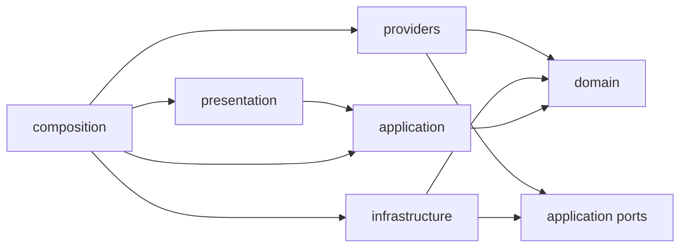

# Architecture boundaries

TicketAutomation is moving from its current flat package to explicit layers. New
code follows these boundaries while later remediation tickets move the existing
runtime code. TA-FND-001 creates the package roots and guardrails; it does not
move runtime behavior.

## Layer responsibilities

- `domain` owns provider-neutral business concepts, values, and invariants. It
  has no dependency on application orchestration, adapters, presentation, CLI,
  subprocess, filesystem, or Git code.
- `application` owns use cases and the ports they require. It may depend on the
  domain. It does not depend on concrete providers or infrastructure.
- `providers` contains concrete agent adapters. An adapter may depend on domain
  contracts and application ports, but it does not depend on lifecycle stage
  implementations.
- `infrastructure` contains concrete persistence, process, filesystem, and Git
  adapters. Infrastructure implements application-owned ports.
- `presentation` translates user input and renders user-facing output. It calls
  application use cases and is never imported by an inward layer or adapter.
- `composition` selects concrete adapters and connects them to application use
  cases. Provider selection and process startup belong here.

The dependency direction is inward: presentation and composition call the
application, and the application calls the domain. Concrete adapters point to
ports owned by `application`; application code never imports an adapter to use
it. Composition is the only layer that knows the complete concrete object graph.

Provider-specific configuration, command construction, failure details, and
native diagnostic evidence live in the corresponding package under `providers`.
Application and domain code use provider-neutral policy and evidence contracts.
A provider-neutral evidence envelope may reference native provider artifacts,
but those artifacts and their codecs remain with the provider.

## Enforced rules

The AST fitness checks in `tests/architecture_fitness.py` inspect source without
importing production modules. They enforce the dependency direction, keep
concrete provider names out of domain and application code, and reject an import
of a leading-underscore symbol from another module. A private symbol is local to
the module that defines it; sharing behavior requires a public contract owned by
the appropriate layer.

The current flat package has a finite set of private-import and concrete-provider
violations. The fitness check classifies the existing lifecycle and writable
execution modules as application code while they await their later moves. Each
exact importer, imported module, and symbol is recorded in `ARCHITECTURE_DEBT`
with a removal ticket and rationale. Wildcards and package-wide exemptions are
not supported. A new violation fails the repository check. Removing an existing
violation also fails until its now-stale allowlist entry is deleted, so the debt
baseline can only shrink through an explicit change associated with its removal
ticket. The program is complete when the allowlist is empty.
